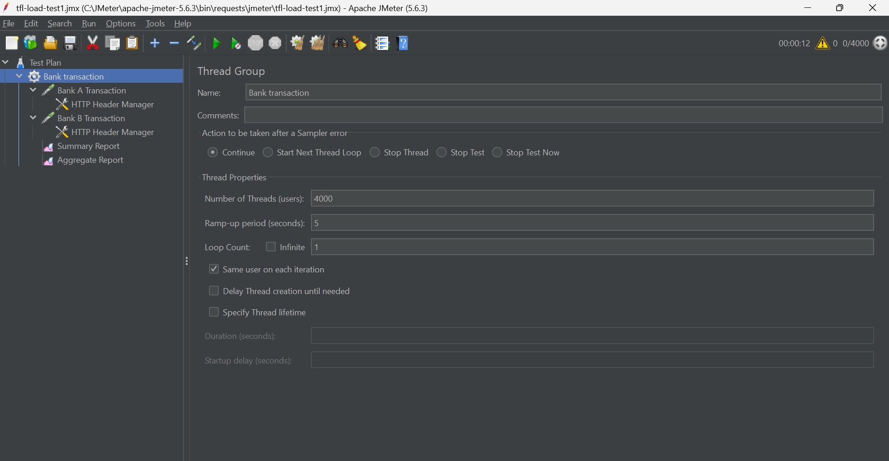
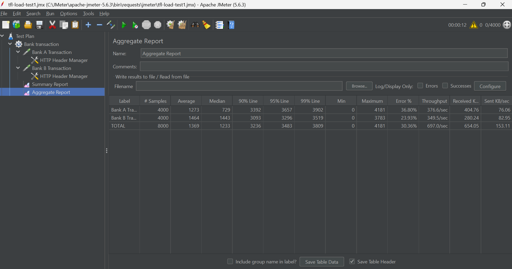
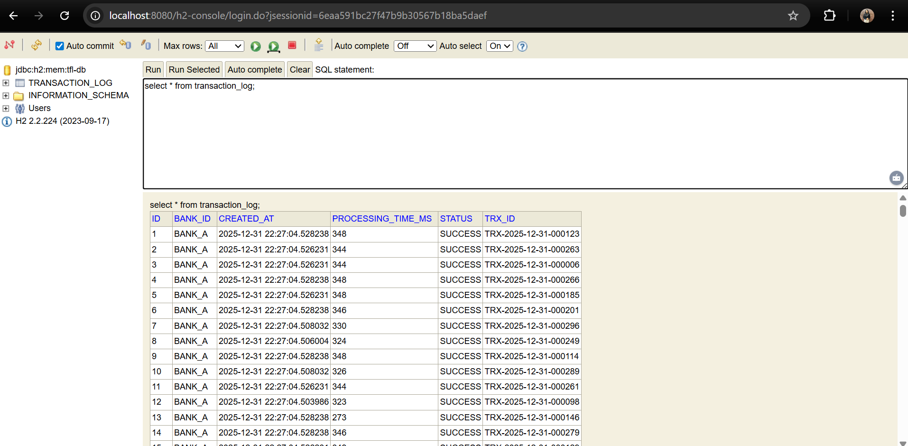

# Trust Fintech Assessment

## Project Overview
This project is developed as part of the **Trust Fintech Java Developer Assessment**.  
It demonstrates a concurrent transaction processing system where multiple client banks forward transaction requests to a central server for processing.

The system is designed to handle **high concurrency**, ensure **unique transaction IDs**, and maintain **transaction logs** for verification.

---

## Architecture
The system consists of three independent Spring Boot applications:

- **Client Bank A**
- **Client Bank B**
- **Central Server**

### Flow:
1. Client banks accept transaction requests in **JSON format**
2. Requests are converted to **XML**
3. XML requests are forwarded to the **Server**
4. Server processes transactions concurrently
5. Each transaction is logged in the database

---

## Technology Stack
- Java 17  
- Spring Boot 3.2.x  
- REST APIs  
- ExecutorService (Concurrency)  
- H2 In-Memory Database  
- Apache JMeter 5.6.3  
- Maven  

---

## Concurrency Design
- The server uses a **fixed thread pool (ExecutorService)** to process transactions concurrently
- Multiple client requests are handled in parallel
- Thread-safe logic ensures **no data corruption**

---

## Transaction ID Uniqueness
- Each transaction is assigned a **unique `trxId`**
- The ID generation logic is thread-safe to prevent duplication under high load
- Uniqueness is verified during concurrent processing

---

## Database Design
- **H2 in-memory database** is used
- Stores transaction audit logs
- Allows easy verification during testing
- Suitable for development, testing, and demonstration purposes

---

## Load Testing
Load testing was performed using **Apache JMeter**.

### Test Details:
- Tool: Apache JMeter 5.6.3
- Concurrent Users:
  - Bank A: 4000
  - Bank B: 4000
- Total Requests: 8000
- Average Response Time: ~520 ms
- Throughput: ~1200 requests/sec

### Observations:
- Majority of requests were processed successfully
- Some connection failures occurred at peak load due to **local system resource constraints**
- Transaction records were successfully persisted in the database

---

## Load Testing Evidence

### JMeter Thread Group Configuration

### JMeter Summary Report

### JMeter Aggregate Report

---

## Database Verification (H2)

---

## How to Run the Project

### Start Applications:
1. Start **Server** (Port: 8080)
2. Start **Client Bank A** (Port: 8081)
3. Start **Client Bank B** (Port: 8082)

### Run Load Test:
- Open Apache JMeter
- Load `tfl-load-test.jmx`
- Execute the test plan

---

## ✅ Conclusion
This project successfully demonstrates:
- Concurrent transaction processing
- Thread-safe transaction ID generation
- Inter-service communication using REST and XML
- Load testing under high concurrency
- Transaction logging and verification

---

## Author
**Akshada Shinde**  
Software Developer
